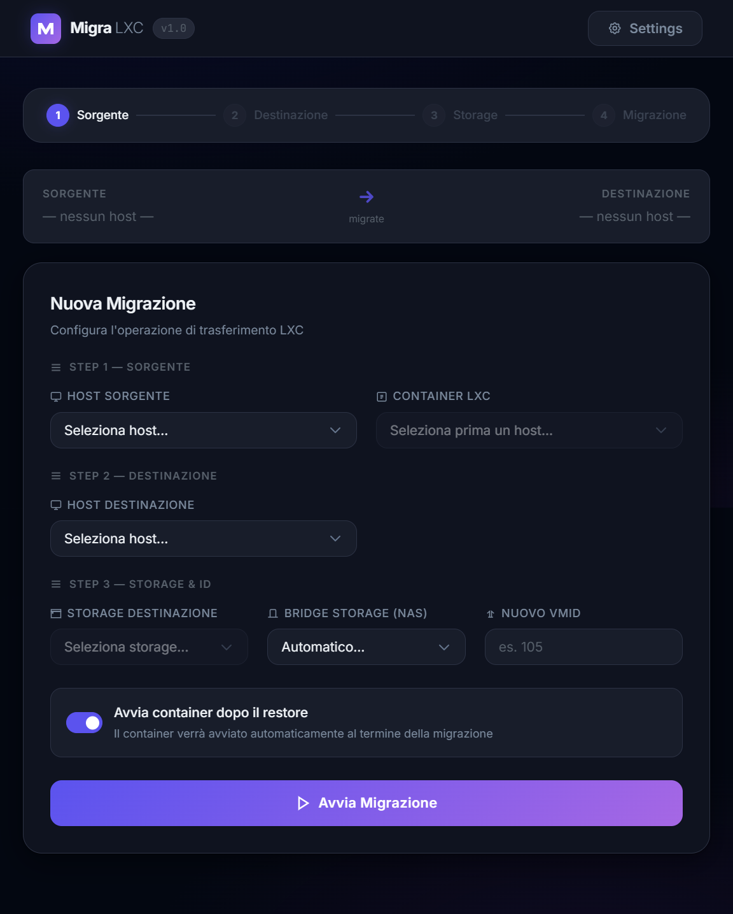

# 🛡️ MIGRA LXC: Proxmox Migration Tool

**MIGRA LXC** è uno strumento web-based progettato per migrare container LXC tra nodi Proxmox non in cluster, utilizzando uno storage condiviso (NAS/NFS/CIFS) come ponte temporaneo.



---

## 🚀 Funzionalità Principali

-   **Migrazione End-to-End**: Automatizza Stop -> Backup -> Restore -> Start -> Cleanup.
-   **Supporto API Proxmox**:
    -   Autenticazione via **Password** (PVE Ticket) o **API Tokens** (PVEAPIToken).
    -   Gestione multi-host con salvataggio sicuro in `config/hosts.json`.
-   **Dashboard Intelligente**:
    -   Suggerimento automatico del **nuovo VMID** (ID libero più basso sul nodo di destinazione).
    -   Selezione intelligente del nodo: se il cluster ha un solo nodo, viene pre-selezionato e nascosto.
    -   Lista container LXC filtrata per host sorgente.
-   **Feedback in Tempo Reale**:
    -   Avanzamento della migrazione visibile tramite **WebSocket**.
    -   Barra di caricamento dinamica basata sul progresso reale dei task di Proxmox.
-   **Interfaccia Moderna**:
    -   Design "Glassmorphism" professionale e reattivo.
    -   Gestione completa Host (CRUD) direttamente dal browser.
-   **Gestione Servizio**: Script Bash pronti per l'installazione come servizio `systemd`.

---

## 🛠️ Requisiti

1.  **Node.js v18+** installato.
2.  **Storage condiviso (Bridge)**: Uno storage (es. NFS o CIFS) deve essere visibile e montato con lo stesso nome su tutti i nodi Proxmox (es. `OVM-2TB`).
3.  **Permessi Proxmox**: L'utente o il token utilizzato devono avere i permessi per `vzdump`, `create`, `delete` e `config` sui nodi interessati.

---

## 📦 Installazione

1.  Clona il repository nella tua cartella preferita (es. `/migra`).
2.  Installa le dipendenze:
    ```bash
    npm install
    ```
3.  Crea la cartella di configurazione:
    ```bash
    mkdir -p config
    ```

---

## ⚙️ Gestione come Servizio (Systemd)

Puoi gestire l'app come un servizio di sistema linux utilizzando lo script `manage.sh`:

```bash
chmod +x manage.sh migra-worker.sh

# Installa il servizio migra.service
sudo ./manage.sh install

# Abilita l'avvio al boot
sudo ./manage.sh enable

# Avvia il servizio
sudo ./manage.sh start
```

### Comandi disponibili:
*   `sudo ./manage.sh status`: Controlla lo stato del servizio e i log.
*   `sudo ./manage.sh stop`: Ferma l'applicazione.
*   `sudo ./manage.sh restart`: Riavvia backend e frontend.

---

## 🖥️ Utilizzo

1.  Collegati all'indirizzo `http://<tuo-ip-server>:3001`.
2.  Vai in **Settings** e aggiungi i tuoi Host Proxmox (IP, Utente e API Token o Password). Usa il tasto **TEST CONNESSIONE** per verificare che sia tutto configurato correttamente.
3.  Ricarica la pagina principale.
4.  Seleziona l'Host Sorgente. Verranno caricati tutti gli LXC disponibili.
5.  Seleziona l'Host Destinazione. Il sistema suggerirà automaticamente un ID libero e selezionerà lo storage disponibile.
6.  Scegli se avviare il container dopo il restore tramite l'apposito checkbox.
7.  Clicca su **AVVIA MIGRAZIONE** e segui il progresso dal log box.
8.  Al termine, conferma se desideri cancellare il container originale e il file di backup temporaneo (Cleanup).

---

## 🛡️ Sicurezza

-   Lo strumento utilizza connessioni HTTPS (ignora avvisi certificati self-signed di Proxmox).
-   Le password sono salvate nel file `config/hosts.json`. Si consiglia l'uso di **API Tokens** con privilegi limitati per una maggiore sicurezza.

---

## 🌐 Nginx Proxy Manager (NPM) Setup

Se utilizzi **Nginx Proxy Manager**, segui questi passaggi per farlo funzionare correttamente:

1.  **Forward Host/Port**: Inserisci l'IP del server dove gira Migra LXC e la porta `3001`.
2.  **Websockets Support**: ⚠️ **IMPORTANTE**: Attiva l'interruttore **Websockets Support** nella scheda "Details" della configurazione del Proxy Host.
3.  **SSL**: Puoi attivare SSL senza problemi. L'app rileverà automaticamente se usare `http/ws` o `https/wss`.

---

## 📜 Licenza
MIT License - Progetto creato per laboratori e ambienti Proxmox.
